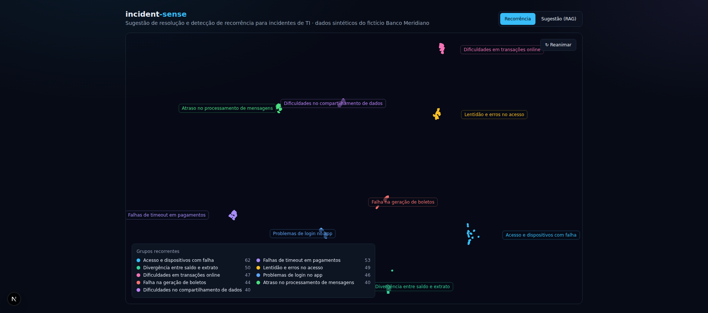
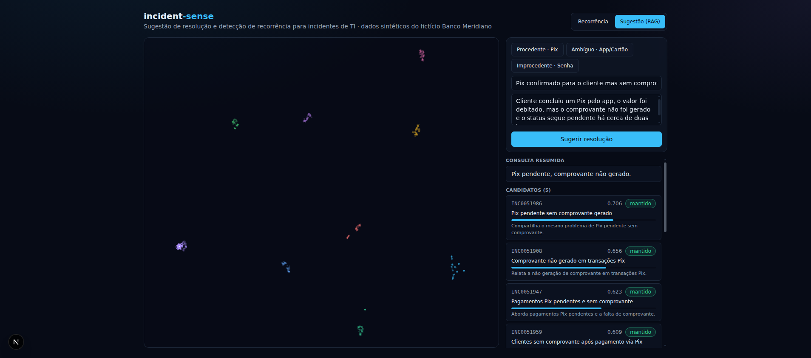

> 🇧🇷 Versão em português (principal): [README.md](README.md)

# incident-sense

[](https://github.com/johnlaff/incident-sense/actions/workflows/backend-ci.yml)
[](https://github.com/johnlaff/incident-sense/actions/workflows/frontend-ci.yml)
[](LICENSE)

When a large bank hits an IT problem — Pix payments timing out, the app
rejecting logins, boletos failing to generate — operations asks two questions:

1. **Have we solved this before? How?** The analyst burns time hunting for a
   similar past ticket among thousands.
2. **Is this becoming recurring?** Many similar incidents may actually be the
   **same** underlying problem — and nobody notices in the volume.

**incident-sense** tackles both:

- **Resolution suggestion (RAG):** for a new incident, retrieve similar past
  **resolved** incidents and suggest a **grounded** resolution, showing which
  tickets informed it and why.
- **Recurrence detection (clustering):** cluster recent incidents and surface
  recurring problems on an **animated map**, with AI-generated cluster names.

> Everything uses **synthetic** data for a **fictional** bank ("Banco
> Meridiano"). No real data, no real company.

## Demo

| Recurrence detection (clustering) | Resolution suggestion (RAG) |
| --- | --- |
|  |  |

On the left, recent incidents grouped on an animated map with AI-generated
cluster names. On the right, a new incident "flies" to its closest neighbors
while the panel streams each reasoning step.

## Quickstart (one command)

Prerequisites: Docker. That's it.

```bash
git clone https://github.com/johnlaff/incident-sense.git
cd incident-sense
cp .env.example .env      # add your keys (OpenAI + OpenRouter)
docker compose up         # open http://localhost:3000
```

The dataset and clustering results are **committed**, so the recurrence map
works **immediately**, offline. Only the interactive RAG suggestion makes live
API calls (pennies).

> Without keys in `.env`, the cluster map still works; "suggest" shows a friendly
> message asking for the keys.

## How it works

This README is about the **problem**. For the _how_ — stack, both flows, and the
architecture decisions — see:

- [docs/architecture.md](docs/architecture.md) — overview and stack
- [docs/rag-flow.md](docs/rag-flow.md) — the suggestion (RAG) flow
- [docs/clustering-flow.md](docs/clustering-flow.md) — recurrence detection
- [docs/data-generation.md](docs/data-generation.md) — how the synthetic data is
  generated
- [docs/decisions/](docs/decisions/) — ADRs (why LlamaIndex, BERTopic, Qdrant, …)

> Documentation is primarily written in Brazilian Portuguese for the workshop
> audience; this page mirrors the essentials in English.

## Development

```bash
make setup    # install backend (uv) and frontend (npm)
make check    # lint + typecheck + test (backend and frontend)
```

See [CONTRIBUTING.md](CONTRIBUTING.md) for all commands.

## License

[MIT](LICENSE).
