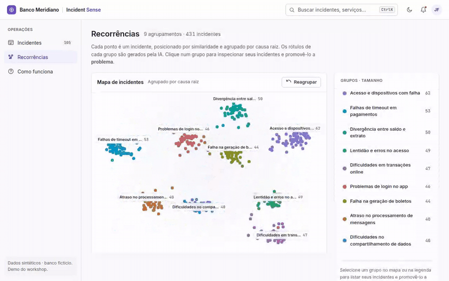
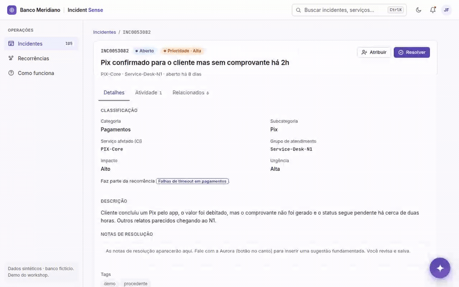
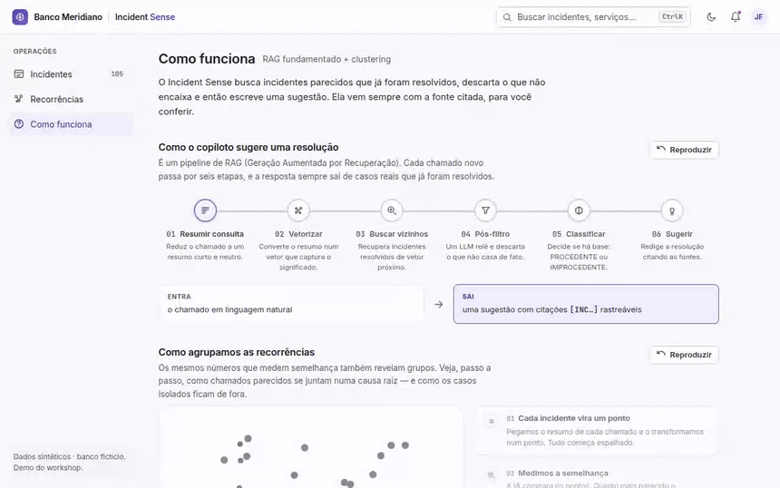
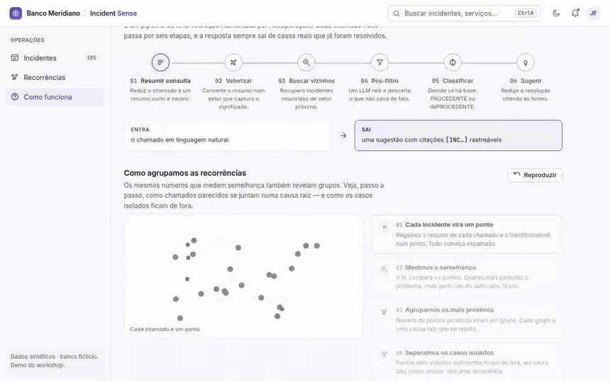

<div align="center">

# 🛰️ incident-sense

**An ITSM workspace with an AI copilot — it suggests _grounded_ resolutions and surfaces _recurring problems_ over a fictional bank's incidents.**

[](https://github.com/johnlaff/incident-sense/actions/workflows/backend-ci.yml)
[](https://github.com/johnlaff/incident-sense/actions/workflows/frontend-ci.yml)
[](LICENSE)

`Python 3.12` · `FastAPI` · `LlamaIndex` · `Qdrant` · `BERTopic` &nbsp;|&nbsp; `Next.js 16` · `React 19` · `TypeScript` · `Tailwind v4`

<sub>🌐 <a href="README.md">Português</a> · <b>English</b></sub>

</div>

---

When a large bank has an IT problem — Pix going down, the app rejecting logins,
boletos failing — the on-call analyst asks **two questions**, and loses time on
both:

1. **Have we solved this before? How?** The answer is in some old, similar
   ticket, buried among thousands.
2. **Is this becoming recurring?** Several similar incidents may actually be the
   **same** underlying problem — and nobody notices in the volume.

**incident-sense** answers both, in a **ServiceNow-faithful** interface — but
with a copilot that **shows its work** instead of asking for blind trust.

> [!NOTE]
> Everything runs on **synthetic** data for a **fictional** bank ("Banco
> Meridiano"). No real data, no real company — this is a _clean-room_ portfolio
> project.

## ✨ What it does

| | |
|---|---|
| 🤖 **Resolution suggestion (RAG)** | For a new incident, the **Aurora** copilot retrieves similar **resolved** tickets and drafts a grounded resolution. |
| 🔎 **Real traceability** | Every suggestion **cites** the incidents it relied on — and you **open each citation right there** to verify the fix actually came from them. No black box. |
| 🗺️ **Recurrence detection (clustering)** | Groups incidents by root cause on an **animated map**, with AI-generated cluster names, and lets you **promote a group to a problem**. |
| ⌨️ **A real workspace** | Browse all 431 incidents, filter, sort, open a record — light/dark theme, **⌘K** for everything, keyboard navigation. |

## 🎬 Demo

**Recurrences** — incidents fly into their root-cause groups, with AI-generated labels:

<div align="center"></div>

**Aurora copilot** — summarizes, retrieves, classifies and suggests a resolution, **citing** its sources (clickable):

<div align="center"></div>

## 🚀 Get started in one command

**Prerequisite:** Docker. That's it.

```bash
git clone https://github.com/johnlaff/incident-sense.git
cd incident-sense
cp .env.example .env      # add your keys (OpenAI + OpenRouter)
docker compose up         # open http://localhost:3000
```

The dataset and clustering results are **committed**, so the recurrence map
works **immediately**, offline. Only the interactive RAG suggestion makes live
AI calls (pennies).

> [!TIP]
> Without keys in `.env`, the cluster map and all navigation work normally; the
> copilot just shows a friendly message asking for the keys.

## 🧠 How it works

### Resolution suggestion — grounded RAG

RAG (Retrieval-Augmented Generation) means the AI **doesn't make up** the answer:
it first **retrieves** similar real cases and only then **writes** the suggestion
from them. Each new ticket goes through six steps, and the answer always carries
its source:

The **How it works** screen animates this pipeline live — the incident's summary flows through the six steps:

<div align="center"></div>

Step **5** is what avoids noise: a request like _"I forgot my password"_ is
classified as **improcedente** (self-service, not an incident) instead of being
forced a technical resolution. Details in [docs/rag-flow.md](docs/rag-flow.md).

### Recurrence detection — clustering

The same vectors that measure similarity also reveal **groups**. We reduce
incidents to a 2D map (UMAP), cluster the nearby ones by root cause (HDBSCAN),
and let an LLM **name** each group. The result is precomputed and versioned, so
the map opens instantly and identically for everyone.

<div align="center"></div>

Details in [docs/clustering-flow.md](docs/clustering-flow.md).

## 🏗️ Architecture

<div align="center">
  
</div>

| Layer | Stack |
| --- | --- |
| **Frontend** | Next.js 16 (App Router) · React 19 · strict TypeScript · Tailwind v4 · Motion |
| **Backend** | Python 3.12 · FastAPI · LlamaIndex · Pydantic · structlog |
| **AI** | OpenAI `text-embedding-3-large` (embeddings) · OpenRouter (LLM) |
| **Data** | Qdrant (vector search) · BERTopic + UMAP + HDBSCAN (clustering) |
| **Infra** | Docker Compose · GitHub Actions (CI) · multi-stage non-root images |

## 📁 Structure

```text
incident-sense/
├── backend/      # FastAPI: RAG, served clustering, incident browse
│   ├── src/incident_sense/   # api, rag, data, models
│   └── data/                 # dataset + embeddings + clusters (committed)
├── frontend/     # Next.js: workspace, Aurora copilot, recurrence map
│   ├── app/                  # routes (incidents, detail, recurrences, …)
│   ├── components/           # shell, icons, UI primitives
│   └── lib/                  # typed API client + mapping layer
└── docs/         # architecture, flows and ADRs
```

## 🛠️ Development

```bash
make setup    # install backend (uv) and frontend (npm)
make check    # lint + typecheck + tests (backend and frontend)
make up       # bring up the full stack via Docker Compose
```

See [CONTRIBUTING.md](CONTRIBUTING.md) for all commands.

## 📚 Dive deeper

- [docs/architecture.md](docs/architecture.md) — overview and stack
- [docs/rag-flow.md](docs/rag-flow.md) — the suggestion (RAG) flow
- [docs/clustering-flow.md](docs/clustering-flow.md) — recurrence detection
- [docs/data-generation.md](docs/data-generation.md) — how the synthetic data is generated
- [docs/decisions/](docs/decisions/) — ADRs (why LlamaIndex, BERTopic, Qdrant…)

## 📄 License

Released under the [**MIT**](LICENSE) license — free to study, use and adapt. The
data is **synthetic and fictional**: no real information is used or distributed.
