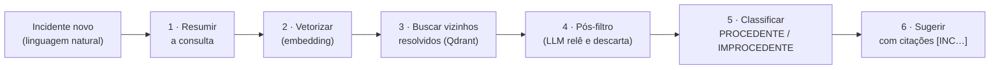
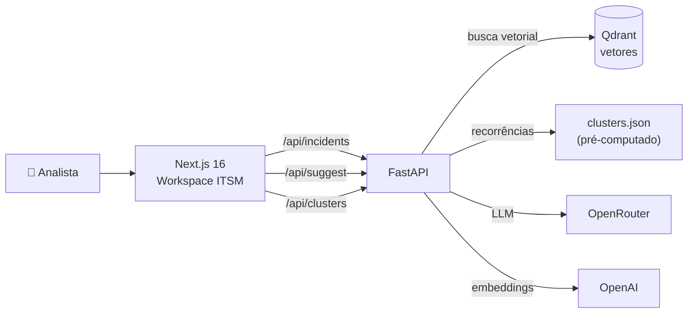

<div align="center">

# 🛰️ incident-sense

**Estação de trabalho ITSM com copiloto de IA — sugere resoluções _fundamentadas_ e revela _problemas recorrentes_ sobre os incidentes de um banco fictício.**

[](https://github.com/johnlaff/incident-sense/actions/workflows/backend-ci.yml)
[](https://github.com/johnlaff/incident-sense/actions/workflows/frontend-ci.yml)
[](LICENSE)

`Python 3.12` · `FastAPI` · `LlamaIndex` · `Qdrant` · `BERTopic` &nbsp;|&nbsp; `Next.js 16` · `React 19` · `TypeScript` · `Tailwind v4`

🇺🇸 [English version](README.en.md)

</div>

---

Quando um banco grande tem um problema de TI — o Pix parando, o app recusando
login, o boleto não saindo — o analista de plantão se faz **duas perguntas**, e
perde tempo nas duas:

1. **Já resolvemos isso antes? Como?** A resposta está num chamado antigo
   parecido, perdido em meio a milhares.
2. **Isso está virando recorrência?** Vários incidentes parecidos podem ser, na
   verdade, o **mesmo** problema de fundo — e ninguém percebe no meio do volume.

O **incident-sense** responde as duas, numa interface **fiel ao ServiceNow** —
mas com um copiloto que **mostra o trabalho** em vez de pedir confiança cega.

> [!NOTE]
> Tudo roda sobre dados **sintéticos** de um banco **fictício** ("Banco
> Meridiano"). Nenhum dado real, nenhuma empresa real — é um projeto de
> portfólio _clean-room_.

## ✨ O que ele faz

| | |
|---|---|
| 🤖 **Sugestão de resolução (RAG)** | Para um incidente novo, o copiloto **Aurora** recupera chamados **resolvidos** semelhantes e redige uma resolução fundamentada. |
| 🔎 **Rastreabilidade real** | Cada sugestão **cita** os incidentes em que se baseou — e você **abre cada citação ali mesmo** para conferir se a solução veio de fato deles. Sem caixa-preta. |
| 🗺️ **Detecção de recorrência (clustering)** | Agrupa os incidentes por causa raiz num **mapa animado**, com nomes de grupo gerados por IA, e permite **promover um grupo a problema**. |
| ⌨️ **Workspace de verdade** | Navegue por todos os 431 incidentes, filtre, ordene, abra um registro — tema claro/escuro, **⌘K** para tudo, navegação por teclado. |

## 🎬 Demo

| Detecção de recorrência (clustering) | Sugestão de resolução (RAG) |
| :---: | :---: |
|  |  |
| Incidentes agrupados por causa raiz, com rótulos gerados por IA. | A Aurora sugere uma resolução e **cita** os incidentes que a embasam — clicáveis para inspeção. |

## 🚀 Comece em um comando

**Pré-requisito:** Docker. Só isso.

```bash
git clone https://github.com/johnlaff/incident-sense.git
cd incident-sense
cp .env.example .env      # adicione suas chaves (OpenAI + OpenRouter)
docker compose up         # abra http://localhost:3000
```

O dataset e os resultados de clustering já vêm **commitados**, então o mapa de
recorrência funciona **na hora**, offline. Só a sugestão interativa (RAG) faz
chamadas de IA ao vivo (custo de centavos).

> [!TIP]
> Sem as chaves no `.env`, o mapa de clusters e toda a navegação funcionam
> normalmente; o copiloto apenas mostra uma mensagem amigável pedindo as chaves.

## 🧠 Como funciona

### Sugestão de resolução — RAG fundamentado

RAG (_Retrieval-Augmented Generation_, "geração aumentada por recuperação")
significa que a IA **não inventa** a resposta: ela primeiro **busca** casos reais
parecidos e só então **redige** a sugestão a partir deles. Cada chamado novo
passa por seis etapas, e a resposta sempre carrega a fonte:



O passo **5** é o que evita ruído: um pedido como _"esqueci minha senha"_ é
classificado como **improcedente** (autoatendimento, não um incidente), em vez de
receber uma resolução técnica forçada. Detalhes em
[docs/rag-flow.md](docs/rag-flow.md).

### Detecção de recorrência — clustering

Os mesmos vetores que medem semelhança também revelam **grupos**. Reduzimos os
incidentes a um mapa 2D (UMAP), agrupamos os próximos por causa raiz (HDBSCAN) e
deixamos um LLM **nomear** cada grupo. O resultado é pré-computado e versionado,
então o mapa abre instantâneo e idêntico para todos. Detalhes em
[docs/clustering-flow.md](docs/clustering-flow.md).

## 🏗️ Arquitetura



| Camada | Stack |
| --- | --- |
| **Frontend** | Next.js 16 (App Router) · React 19 · TypeScript estrito · Tailwind v4 · Motion |
| **Backend** | Python 3.12 · FastAPI · LlamaIndex · Pydantic · structlog |
| **IA** | OpenAI `text-embedding-3-large` (embeddings) · OpenRouter (LLM) |
| **Dados** | Qdrant (busca vetorial) · BERTopic + UMAP + HDBSCAN (clustering) |
| **Infra** | Docker Compose · GitHub Actions (CI) · imagens multi-stage não-root |

## 📁 Estrutura

```text
incident-sense/
├── backend/      # FastAPI: RAG, clustering servido, browse de incidentes
│   ├── src/incident_sense/   # api, rag, data, models
│   └── data/                 # dataset + embeddings + clusters (commitados)
├── frontend/     # Next.js: workspace, copiloto Aurora, mapa de recorrências
│   ├── app/                  # rotas (incidentes, detalhe, recorrências, …)
│   ├── components/           # shell, ícones, primitivas de UI
│   └── lib/                  # cliente de API tipado + camada de mapeamento
└── docs/         # arquitetura, fluxos e ADRs
```

## 🛠️ Desenvolvimento

```bash
make setup    # instala backend (uv) e frontend (npm)
make check    # lint + typecheck + testes (backend e frontend)
make up       # sobe a stack completa via Docker Compose
```

Veja [CONTRIBUTING.md](CONTRIBUTING.md) para todos os comandos.

## 📚 Aprofunde

- [docs/architecture.md](docs/architecture.md) — visão geral e stack
- [docs/rag-flow.md](docs/rag-flow.md) — o fluxo de sugestão (RAG)
- [docs/clustering-flow.md](docs/clustering-flow.md) — a detecção de recorrência
- [docs/data-generation.md](docs/data-generation.md) — como os dados sintéticos são gerados
- [docs/decisions/](docs/decisions/) — ADRs (por que LlamaIndex, BERTopic, Qdrant…)

## 📄 Licença

[MIT](LICENSE).
