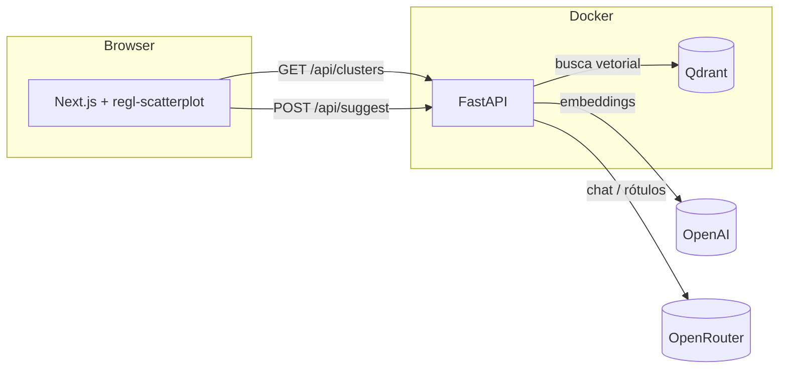
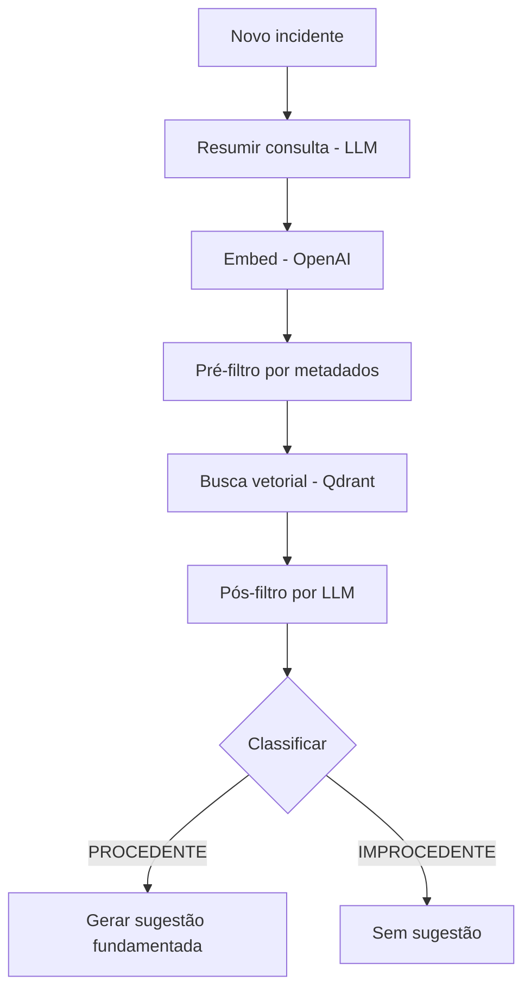

# Arquitetura

> O **problema** e o caso de uso ficam no [README](../README.md). Aqui está
> _como_ o sistema é construído.

## Visão geral

O `incident-sense` é um monólito simples com três peças que sobem juntas via
`docker compose`:



- **Frontend** (`frontend/`): Next.js (App Router) + TypeScript + Tailwind +
  shadcn/ui. O mapa animado usa **regl-scatterplot** (WebGL) e **Motion**.
- **API** (`backend/`): FastAPI. Orquestra o RAG com **LlamaIndex** e serve o
  resultado de clustering pré-computado.
- **Qdrant**: banco vetorial local com os incidentes resolvidos.

## Stack (resumo)

| Camada      | Tecnologia                                                        |
| ----------- | ----------------------------------------------------------------- |
| API         | Python 3.12, FastAPI, pydantic-settings, structlog                |
| RAG         | LlamaIndex, OpenAI embeddings (`text-embedding-3-large`, 3072d)   |
| Chat/LLM    | OpenRouter (compatível com OpenAI), modelo configurável           |
| Vetorial    | Qdrant (cosseno, 3072d)                                           |
| Clustering  | BERTopic (UMAP cosseno 2D + HDBSCAN + rótulos por LLM)            |
| Frontend    | Next.js, TypeScript, Tailwind, shadcn/ui, regl-scatterplot, Motion |
| Qualidade   | ruff, mypy, pytest · eslint, tsc, vitest                          |

As decisões por trás de cada escolha estão em [decisions/](decisions/).

## Os dois fluxos

### 1. Sugestão de resolução (RAG) — `POST /api/suggest`

Recupera incidentes passados resolvidos parecidos e sugere uma resolução
fundamentada. Detalhes em [rag-flow.md](rag-flow.md).



### 2. Detecção de recorrência (clustering) — `GET /api/clusters`

Serve o resultado **pré-computado e commitado**: cada incidente como um ponto 2D
com seu cluster e rótulo. Detalhes em [clustering-flow.md](clustering-flow.md).

## Dados e determinismo

O dataset sintético e os artefatos pré-computados (embeddings e clustering) são
**gerados uma vez e commitados**. A visualização renderiza sem nenhuma chamada
de API; só o "suggest" interativo chama o LLM ao vivo. Veja
[data-generation.md](data-generation.md) e o
[ADR 0006](decisions/0006-execucao-local-e-determinismo.md).

## Layout do repositório

```
backend/   API FastAPI, pipeline RAG, clustering, scripts e dados commitados
frontend/  app Next.js, mapa WebGL e cliente de API tipado
docs/      esta documentação (PT-BR) e os ADRs
```

## Configuração

Tudo por variáveis de ambiente (12-factor) via pydantic-settings — ver
`.env.example`. Segredos nunca são commitados; o `.env` real é gitignored.
