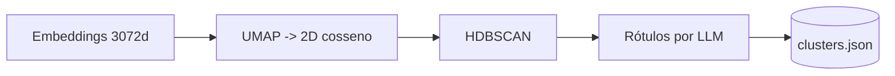

# Fluxo de detecção de recorrência (clustering)

Este é o caminho **offline e determinístico**: agrupar incidentes recentes para
revelar problemas recorrentes, exibidos como um mapa animado com rótulos gerados
por IA.

O endpoint é `GET /api/clusters`, que serve **verbatim** um resultado
pré-computado e commitado — zero chamadas de API, renderização idêntica sempre.

## A pipeline (BERTopic)

A recomputação (`backend/scripts/precompute.py`) usa o **BERTopic**, que encadeia:



1. **Embeddings** dos incidentes (OpenAI, 3072d) — os mesmos commitados que
   semeiam o Qdrant.
2. **UMAP** reduz para **2D** com métrica **cosseno** e `random_state` fixo. As
   coordenadas 2D já saem prontas para plotar.
3. **HDBSCAN** agrupa sobre o espaço reduzido. Pontos em regiões de baixa
   densidade viram **ruído** (`cluster_id = -1`) — os _outliers_.
4. A **representação OpenAI** do BERTopic gera um **rótulo curto em português**
   para cada cluster (ex.: "Timeout em pagamentos via Pix").

O resultado por incidente: `{ id, x, y, cluster_id, cluster_label, is_outlier,
short_description, priority }`.

## Por que essas escolhas

### Por que cosseno

Como no RAG: embeddings codificam significado pela direção, então a distância
angular agrupa por semelhança semântica melhor que a euclidiana crua.

### O que é o ruído / `-1`

O HDBSCAN não força todo ponto a um cluster. O que não tem vizinhança densa o
suficiente é marcado como **ruído** (`cluster_id = -1`). Na visualização esses
outliers aparecem em **cinza**, de-enfatizados — é o tratamento de ruído
acontecendo à vista.

### Por que clusterizar em 2D

O BERTopic clusteriza sobre o espaço reduzido pelo UMAP. Reduzindo direto para
2D, o mesmo espaço serve para **clusterizar** e para **plotar** — simples e
legível para um dataset deste tamanho.

## Determinismo

Seeds fixos no UMAP (e HDBSCAN determinístico) tornam o layout reprodutível. Os
rótulos vêm do LLM e são **congelados** no `clusters.json` commitado, então a
visualização não muda entre execuções nem precisa de chave de API.

## Recomputar

```bash
make precompute        # reembed + reclusteriza + rerotula (precisa de chaves)
```

Veja [data-generation.md](data-generation.md) para como o dataset por trás é
gerado.
