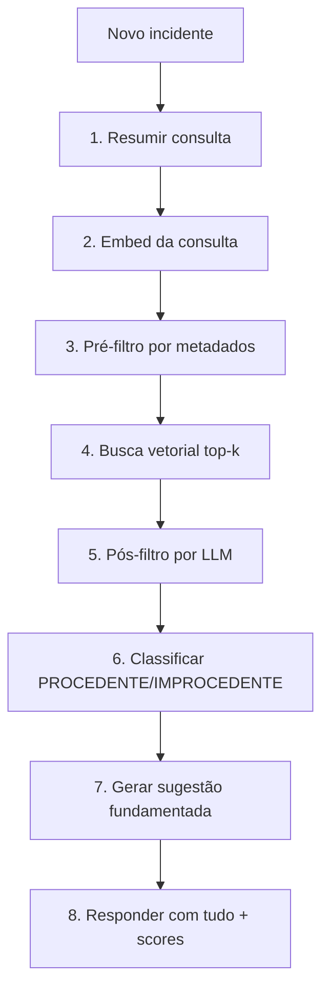

# Fluxo de sugestão (RAG)

Este é o caminho **ao vivo** do demo: dado um novo incidente, encontrar
incidentes passados resolvidos parecidos e sugerir uma resolução fundamentada.

O endpoint é `POST /api/suggest`. Cada etapa é uma função pequena e testável em
`backend/src/incident_sense/rag/pipeline.py`.

## As etapas

1. **Resumir** o incidente em uma consulta curta de busca (LLM). Tira ruído e
   deixa os termos técnicos essenciais.
2. **Embed** da consulta com a OpenAI (`text-embedding-3-large`).
3. **Pré-filtro** opcional por metadados no Qdrant (categoria/serviço), para
   estreitar candidatos quando há dicas. Sem dicas, a busca fica ampla.
4. **Busca vetorial** retornando os `EXAMPLE_TOP_K` mais próximos acima de
   `EXAMPLE_MIN_SIMILARITY`.
5. **Pós-filtro por LLM** (um _node postprocessor_ do LlamaIndex): descarta os
   falsos positivos da busca.
6. **Classificar** como `PROCEDENTE` (existe resolução conhecida aplicável) ou
   `IMPROCEDENTE` (sem correspondência acionável), com saída estruturada.
7. Se `PROCEDENTE`, **gerar a sugestão** fundamentada nas `resolution_notes` dos
   candidatos sobreviventes, citando quais incidentes a embasaram.
8. **Responder** com a classificação, a sugestão (ou `null`) e **todos** os
   candidatos recuperados — com score de similaridade e se sobreviveram ao
   pós-filtro. Essa transparência é proposital (didática).

## Por que essas escolhas

### Por que cosseno

Os embeddings representam significado pela **direção** do vetor. A similaridade
de cosseno mede o ângulo entre vetores, então captura "estes textos falam da
mesma coisa" melhor que a distância euclidiana crua.

### Por que um pós-filtro por LLM depois da busca vetorial

A busca vetorial é orientada a **recall**: ela traz tudo que é parecido, e às
vezes traz um incidente que só **compartilha palavras** ("lentidão", "erro") sem
ter a mesma causa. O pós-filtro pede ao LLM uma decisão de relevância por
candidato, removendo esses falsos positivos antes de classificar e sugerir.

### Sobre os limiares (`top_k`, `min_similarity`)

São **valores de exemplo** (`top_k=5`, `min_similarity=0.4`) escolhidos para o
demo, não tuning de produção de ninguém. Ficam comentados em `config.py` e podem
ser ajustados por variável de ambiente.

## Os 3 incidentes-demo

O dataset planta 3 incidentes para o demo ao vivo:

- **PROCEDENTE** — casa fortemente com um arquétipo resolvido (ex.: timeout no
  Pix). Deve gerar uma sugestão fundamentada.
- **Borderline** — ambíguo de propósito; mostra o pós-filtro trabalhando.
- **IMPROCEDENTE** — sem correspondência operacional (ex.: "esqueci minha
  senha"). Deve resultar em `IMPROCEDENTE`, sem sugestão.

## Testes

Todo o pipeline é testado com LLM/embeddings/Qdrant **mockados** via injeção de
dependência (ver `backend/tests/test_rag.py`) — rápido e sem rede.
